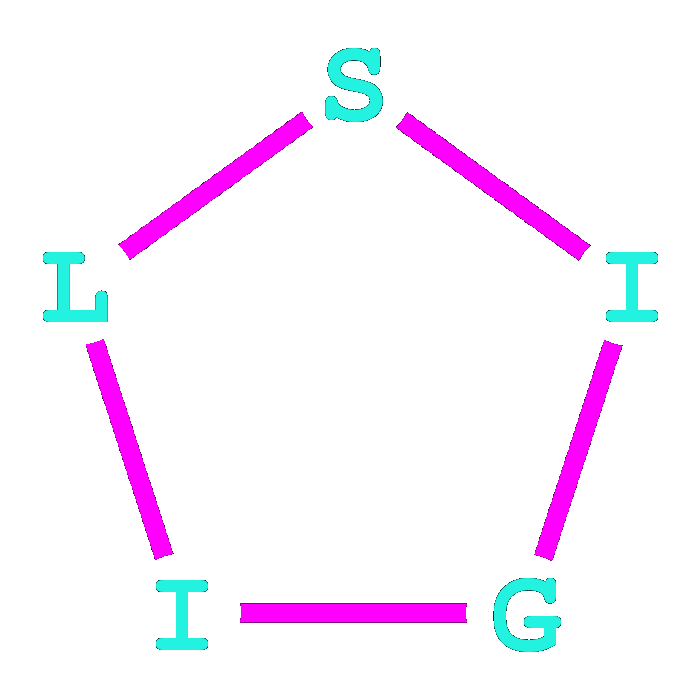

# Sigil

A modified version of TIW's [UV-Static](https://github.com/TheTIW/UV-Static) specifically designed for the [Benrogo.net](https://benrogo.net) proxy network

## Features

- Flexible hosting options
- Improved compatibility over UV-Static
- Automatic link rotation

## Deployment
[Put hosting buttons here, TBD]

Note: This project can also be hosted on **any** static hosting service, including locally hosted, as long as it provides a working HTTPS connection. Trying to host this on an HTTP connection will result in errors with service workers.

## Contributing

Contributions are always welcome! If you have any suggestions for improvements, please make a pull request! If you have a critical issue, such as a vulnerability, please reach out to me directly through email at [ben@benrogo.net](mailto:ben@benrogo.net) or Ben_Da_Builder on Discord.

## License

This project is licensed under the [MIT License](LICENSE).